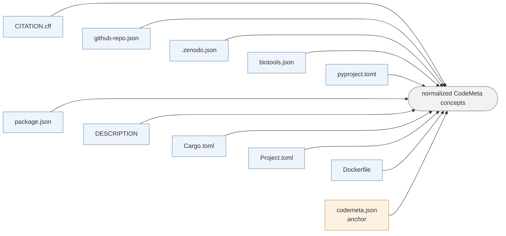

# rs-metadata

This repository generates and defines the [**LUMC CodeMeta profile**](https://lumc-dcc.github.io/rs-metadata/schema/1.0.0/codemeta-lumc.schema.json) with CodeMeta 3.1 vocabulary.
It also checks consistency across the metadata in a repository.
The project supports [LUMC Research Software guidelines on metadata](https://lumc-dcc.github.io/rs-guidelines/go/metadata).

The documentation is available at [lumc-dcc.github.io/rs-metadata](https://lumc-dcc.github.io/rs-metadata/).

## Quick start

```bash
pip install rs-metadata
rs-metadata init
```

`init` creates missing `codemeta.json`, `CITATION.cff`, and CI workflow files.
It uses metadata files and the git remote where possible, and it never
overwrites existing files.

```bash
rs-metadata validate
```

tells you if you still missing real values.

If you already have the metadata files, you can add just one workflow:

```yaml
name: Validate software metadata
on: [push, pull_request]

jobs:
  metadata:
    runs-on: ubuntu-latest
    steps:
      - uses: actions/checkout@v4
      - uses: LUMC-DCC/rs-metadata@v1
```

## What it checks

- **Profile conformance.** Every field the profile includes, in a valid shape,
with a valid JSON-LD context. Values are checked against their declared CodeMeta/schema.org types.
- **Value sanity.** E.g., we check if identifiers (ORCID and ROR) and dates are of valid shape, if the licenses exist, and whether some placeholder values remain.
- **Cross-file consistency.** `codemeta.json` is the anchor metadata; every other metadata file is compared against it.

<!-- Generated by scripts/generate_docs.py from the adapter registry. -->



| Source | Detected as | Required |
|---|---|---|
| CodeMeta | `codemeta.json` | anchor |
| Citation File Format | `CITATION.cff` | yes |
| GitHub repository metadata | `github-repo.json` | auto-detected |
| Zenodo deposition metadata | `.zenodo.json` | auto-detected |
| bio.tools metadata | `biotools.json` | auto-detected |
| Python project metadata | `pyproject.toml` | auto-detected |
| npm package metadata | `package.json` | auto-detected |
| R package DESCRIPTION | `DESCRIPTION` | auto-detected |
| Rust package manifest | `Cargo.toml` | auto-detected |
| Julia project metadata | `Project.toml` / `JuliaProject.toml` | auto-detected |
| Dockerfile (OCI image labels) | `Dockerfile` / `Containerfile` | auto-detected |

Comparison is semantic. `https://spdx.org/licenses/Apache-2.0` equals
`Apache-2.0`, `git+https://github.com/o/t.git` equals
`https://github.com/o/t`, `J. Carberry` matches `Josiah Carberry`, `>=1.24`
equals `>=1.24.0`, and list order never matters.

It does not treat naming conventions as conflicts: a PyPI package named
`my-tool` can match a citation title of `MyTool`. A dependency in only one
file is incomplete metadata, not a contradiction.

## Example output

```
ERROR [consistency.mismatch]
Property: version

  codemeta.json:10
    version = 1.4.0

  CITATION.cff:8
    version = 1.2.0

  version differs between codemeta.json and CITATION.cff.

  Suggested fix:
    Update whichever file is stale so both describe the same release.
```

In CI, the same finding becomes an inline annotation, a job summary, and a machine-readable report.

## Commands

| Command | What it does |
|---|---|
| `rs-metadata init` | Create any missing metadata files and CI workflow |
| `rs-metadata validate` | Validate the current directory |
| `rs-metadata validate --strict` | Treat warnings as failures |
| `rs-metadata validate --format json` | Emit the machine-readable report |
| `rs-metadata explain <code>` | Explain a diagnostic code |

Exit status is `0` when the run passes, `1` when it fails, `2` for a usage
error. Full reference: [Running rs-metadata](https://lumc-dcc.github.io/rs-metadata/using/ci-and-cli.html).

## Contributing

Contributions are welcome! Please read [CONTRIBUTING.md](CONTRIBUTING.md) and [Architecture](https://lumc-dcc.github.io/rs-metadata/developing/architecture.html).

---

## License

This project is licensed under Apache 2.0. See the [LICENSE](LICENSE) file for details.
