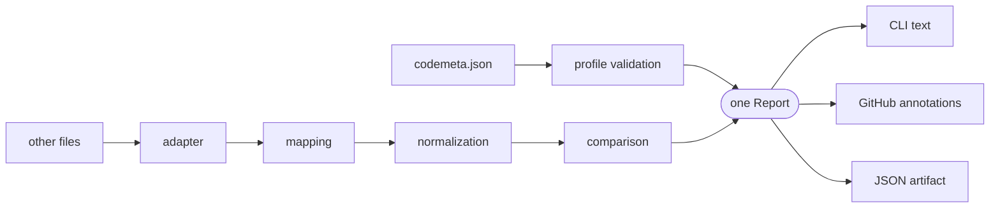
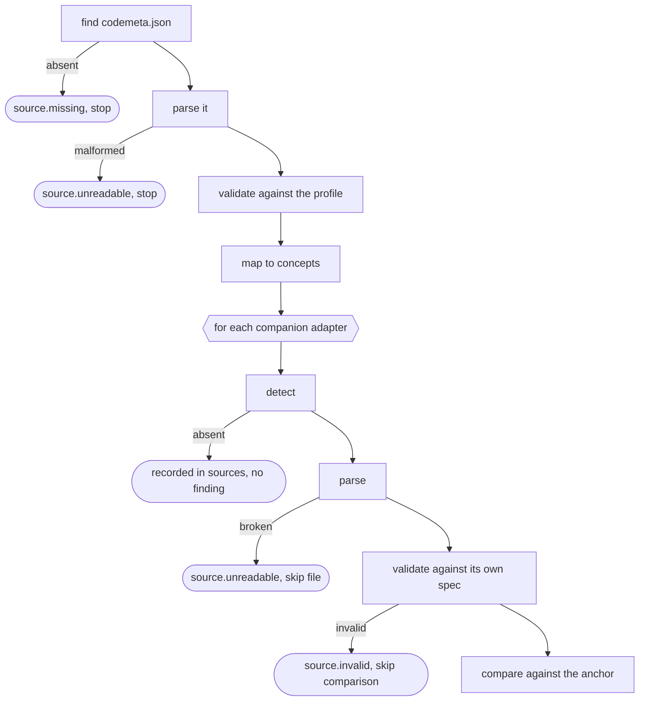

# Architecture

## The shape



Two ideas carry most of the design.

**One report model.** Everything the validator learns becomes a `Report`. The
CLI and the GitHub Action are renderers over it and contain no validation logic
of their own. Someone debugging locally therefore sees exactly what CI
saw.

**One anchor, no pairwise comparators.** `codemeta.json` is compared against
every other metadata file; no two companions are ever compared with each other.
Supporting an *N+1*th format costs one adapter, not *N* new comparators.

## The pipeline

`core.validate()` runs a fixed sequence:



A file that fails its own specification is not compared against the anchor.

## Layers

Each has exactly one job, and keeping them apart is what lets one engine serve
every format.

| Layer | Answers | Lives in |
|---|---|---|
| **Mapping** | Which concepts correspond, and how strictly must they agree? | `mappings/*.yaml` |
| **Adapter** | How do I find, read and understand this file format? | `adapters/` |
| **Normalization** | When do two representations mean the same thing? | `normalize/` |
| **Comparison** | What diagnostic does this outcome deserve? | `consistency/` |

A crosswalk is *not* a validator. It states that CFF's `title` corresponds to
CodeMeta's `name`; it says nothing about whether `MyTool` and `my-tool` are the
same, and nothing about whether a difference should fail a build. Those are the
other two layers.

## Module map

<!-- Generated by scripts/generate_docs.py from each module's own docstring. -->

| Module           | Holds |
|------------------|---|
| `adapters/`      | One module per supported metadata format, plus the registry that lists them. |
| `consistency/`   | The central comparison engine. |
| `locate/`        | Resolve a path inside a parsed document back to a line in the file. |
| `normalize/`     | Normalization and comparison strategies. |
| `profile/`       | Validation of ``codemeta.json`` against the LUMC profile. |
| `renderers/`     | Renderers turn a report into an output format. |
| `vocabulary/`    | The vocabularies the profile is built on, and everything derived from them. |
| `cli.py`         | The ``rs-metadata`` command-line interface. |
| `concepts.py`    | The common representation every metadata source is mapped into. |
| `core.py`        | The validation pipeline. |
| `diagnostics.py` | The catalog of stable diagnostic codes. |
| `mapping.py`     | Loading of the declarative crosswalk mappings. |
| `report.py`      | The validation report: rs-metadata's single output contract. |
| `scaffold.py`    | Creating the metadata files a repository is missing. |

## Key types

```text
ConceptValue(raw, path)     one value plus where it came from
ConceptMap                  {codemeta property: [ConceptValue, ...]}
ParsedSource                one file: document, source map, concepts
Diagnostic                  one finding: code, severity, locations, fix
Report                      sources + diagnostics + summary → the output contract
```

`ConceptValue.path` is the reason findings carry line numbers. It is threaded
from extraction through comparison so that a mismatch discovered late can still
point at the exact place in the original file.

## Invariants

**Validation semantics live in the core.** If the CLI and the Action can
disagree, the logic is in the wrong place.

**No network access in the validator.** Not for DOI resolution, ORCID lookup or
EDAM. The `scripts/vendoring` package is the only code that touches the
network, and the validator never calls it. CI must be deterministic, work
offline, and give the same answer in five years.

**Every finding names the file, the property, the value and a fix.** A
diagnostic a maintainer cannot act on teaches them to ignore the tool.

**One mistake, one diagnostic.** A misspelled `featureList` is simultaneously
an unknown property, a missing mandatory field, and a set of unchecked EDAM
terms. Report the one that explains the actual consequence; suppress the rest.
The `profile/` modules do this in several places, always with a comment
saying which check owns the message.

**Severities are conservative.** A validator that fires on correct metadata
gets deleted from CI, and then it catches nothing at all. Before adding an
error, read the "what is deliberately not reported" list in
[consistency.md](consistency.md).

**Source positions are best-effort.** Nothing in `locate/` may raise. A
diagnostic without a line number is still a correct diagnostic.

**Diagnostic codes are a public interface.** Within a major version a code
never changes meaning. A test asserts that every code emitted anywhere in the
source is registered in the catalog.

## Notable implementation details

**A hand-written JSON position scanner** (`locate/json_map.py`). `json.loads` gives
correct values but no positions. The scanner runs separately and *only*
collects offsets; values always come from `json.loads`, so a disagreement
between the two can corrupt line numbers but never data.

**The CFF loader drops PyYAML's timestamp resolver.** PyYAML resolves
`date-released: 2026-06-01` to a `datetime.date`, but the Citation File Format
specifies that field as a *string*. Resolving it would make a valid file fail
its own schema.

**The CFF adapter recovers raw scalars.** An unquoted `version: 1.20` is the
YAML float `1.2`. The adapter re-reads the scalar text from the compose tree so
the version the author actually wrote is what gets compared.

**Fields declared `comparable: false` are still extracted.** Otherwise the
mapping would claim to have considered a field the code never reads, and the
report could not honestly say it was skipped.

**Name splitting knows about particles.** `Jan van der Berg` is *Jan* + *van
der Berg*. Splitting on whitespace gets many names wrong.

**Missing recommendations are aggregated into one diagnostic**.

## Where to add what

[Recipes](recipes.md) walks through the changes you can make, in order.

## Tests

`tests/` mirrors the concerns:

| Directory | Covers |
|---|---|
| `tests/profile/` | Every profile rule, positive and negative |
| `tests/consistency/` | What must agree, and what is allowed to differ |
| `tests/adapters/` | Per-format parsing and mapping |
| `tests/unit/` | Normalization, CLI, renderers, and structural contracts |

Most tests build a throwaway repository and run the real pipeline over it
rather than calling internals, so a refactor that breaks the wiring fails the
suite.

**Docstring examples are tests.** `pytest` runs with `--doctest-modules` over
`src/`, so every `>>>` in the source is executed on every run. This is the
main reason the examples are worth reading: an example that stops being true
fails the build. Prefer an example over a paragraph when documenting what a
validation rule accepts and rejects — and give both directions, the value that
passes and the one that does not.

`tests/unit/test_contracts.py` is worth knowing about: it guards the seams
between the declarative parts — that the schema's field policy matches its
`required` keyword, that every mapping references a real strategy, that every
adapter emits only concepts its mapping declares, that every emitted code is
documented, and that the generated docs are current.

## See also

| | |
|---|---|
| [Consistency model](consistency.md) | The comparison rules in depth |
| [Adapters](adapters.md) | Adding a metadata format |
| [Crosswalk reference](crosswalk.md) | Generated per-format mapping tables |
| [Report contract](report.md) | The JSON output interface |
| [Releasing](releasing.md) | Version streams and release process |
| [CONTRIBUTING.md](https://github.com/LUMC-DCC/rs-metadata/tree/main/CONTRIBUTING.md) | Setup and conventions |
