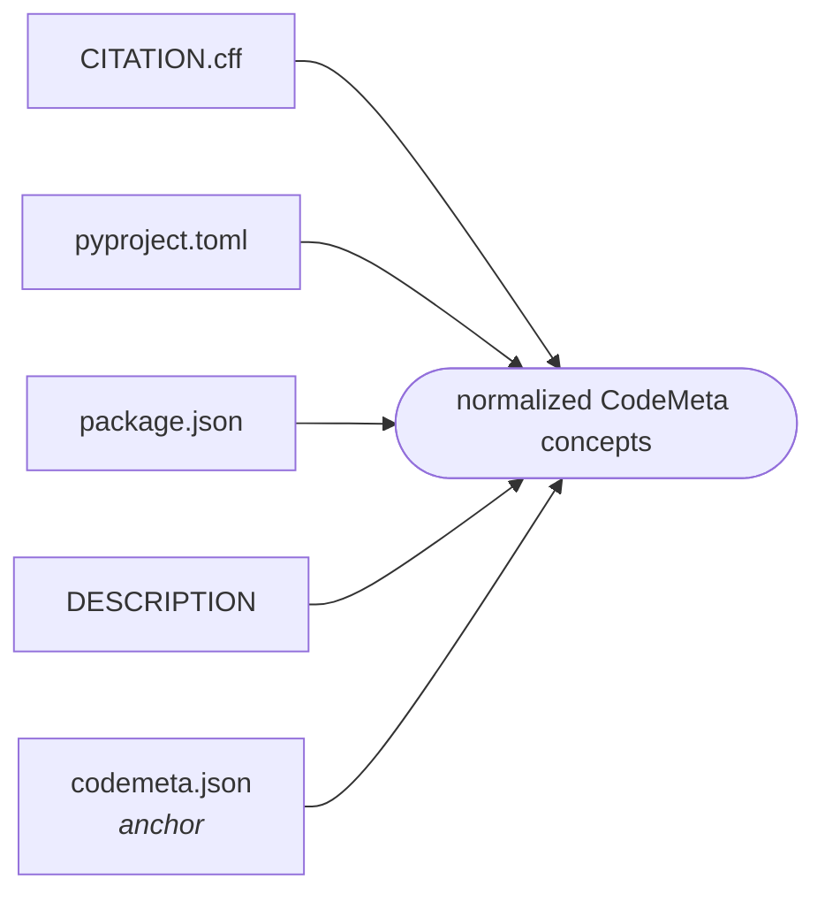

# The consistency model

If a consistency check failed on your
own repository, [diagnostics](../using/diagnostics.md) and the
[FAQ](../using/faq.md) are the faster route; this page explains the machinery
behind them.

A repository usually describes itself several times over: `codemeta.json` for
registries, `CITATION.cff` for citation, `pyproject.toml` for installation.
The files drift. A release bumps the version in one and not the others; an
author joins the project and is added to one list.

rs-metadata's job is to notice that — and, just as importantly, to stay quiet
when two files differ for a good reason.

## codemeta.json is the anchor

Every other metadata file is compared against `codemeta.json`, and never
against another companion file.



Comparing every file against every other would leave findings with no obvious
owner: if `CITATION.cff` and `package.json` disagree, which one is wrong?
Anchoring on `codemeta.json` makes every finding actionable, since the
companion is normally the file to fix.

## Four layers

A crosswalk says which concepts correspond. It does *not* say when two values
mean the same thing, and it does not say how strictly they must agree. Keeping
those apart is what lets one comparison engine serve every format.

```
mapping          which concepts correspond, and how strictly   (declarative YAML)
    ↓
extraction       reading one file format                       (adapter)
    ↓
normalization    when two representations are equivalent       (shared strategies)
    ↓
comparison       producing diagnostics                         (one engine)
```

Adding a format means writing an adapter and a mapping file. No existing
adapter changes, and the engine does not know the new format exists. See
[adapters.md](adapters.md).

## Normalization

Comparison is semantic. Each concept is compared with a named strategy, and
the strategy is recorded on the finding so a reader can tell what counted as
equivalent.

| Strategy | Treats as equal |
|---|---|
| `text` | Case, surrounding whitespace, trailing punctuation |
| `name` | `MyTool` / `my-tool` / `my_tool` — display names and package names |
| `version` | `1.2.0` / `v1.2.0` / `1.2` / R's `1.2-3`; a short commit hash and the full one |
| `uri` | `http`/`https`, `www.`, trailing slash, `.git`, `git+`, `git@host:path`, default ports |
| `spdx` | `https://spdx.org/licenses/MIT` / `MIT` / `mit`; simple SPDX expressions |
| `doi` | `https://doi.org/10.5281/zenodo.1` / `doi:…` / bare, case-insensitively |
| `identifier` | Mixed identifiers: DOIs by DOI rules, everything else as a URI |
| `date` | An ISO date with or without a time part |
| `language` | `Python` and `Python 3.11` |
| `people` | Authors, matched by ORCID first, then by family name with initials accepted |
| `dependency-set` | Requirements, matched by package name across notations |

Collections are compared as sets: **order never matters**.

### Matching people

The hardest case, and the one most likely to generate false alarms.

1. If both entries carry an ORCID, the ORCIDs decide — in both directions. Two
   different ORCIDs are two different people even if the names match exactly.
2. Otherwise, family names must match and given names must be compatible,
   where a single initial is accepted as an abbreviation (`J.` matches
   `Josiah`, but `John` does not match `Jane`).
3. Otherwise, full names are compared after normalization.

Matching is greedy and one-to-one, so two entries can never both claim the
same counterpart.

Names given as a single string are split with Dutch and German particles kept
on the family side: `Jan van der Berg` is *Jan* + *van der Berg*, not *Jan van
der* + *Berg*. `Family, Given` is understood.

## Comparison rules

The mapping declares how strictly each concept must agree.

| Rule | Violated when | Typical use |
|---|---|---|
| `equal` | The sides are not equivalent in either direction | `version`, `license`, `codeRepository` |
| `subset` | The source holds a value the anchor lacks | Identifiers, authors from packaging files |
| `overlap` | The sides share nothing at all | `keywords`, R's multi-purpose `URL` |
| `informational` | Never — differences are reported without judgement | Dependencies, Trove classifiers |

`subset` is asymmetric on purpose: `codemeta.json` is allowed to be richer than
any companion. What it may not do is contradict one.

## Three outcomes

| Outcome | Code | Meaning |
|---|---|---|
| **match** | *(nothing reported)* | The two files agree |
| **mismatch** | `consistency.mismatch` | Both describe the concept, and they disagree |
| **not comparable** | `consistency.uncomparable` | A mapping exists but this value cannot be meaningfully compared |

Plus `consistency.incomplete` (informational): one file records something the
other does not. Not a contradiction, but occasionally it reveals metadata that
was never copied across.

A concept the source simply does not have is not reported at all. `CITATION.cff`
has no field for a programming language and never will; saying so on every run
would be noise.

## What is deliberately not reported

This list matters as much as the rules. Every entry is a case where a naive
comparator would fire on correct metadata.

- **Package name versus display name.** `MyTool` in a citation and `my-tool` on
  PyPI are one piece of software. Compared with separators removed.
- **Summary versus abstract.** PEP 621's `description` is the one-line summary
  that corresponds to core metadata's `Summary`; CodeMeta's `description` is
  the full abstract. They are different fields, so they are marked *not
  comparable* rather than compared.
- **Partial dependency lists.** `codemeta.json` is not obliged to enumerate
  every dependency. Only a package pinned to genuinely incompatible constraints
  in both files is reported, and then as a warning.
- **Dynamic versions.** A `pyproject.toml` declaring `dynamic = ["version"]`
  does not contain a version, so there is nothing to compare.
- **`{file = "LICENSE"}`.** Names a file, not a license. Nothing identifies
  which license it is, so nothing is mapped.
- **Partially overlapping keywords.** Keyword lists legitimately differ in
  detail. Only a *completely* disjoint pair is reported, because that almost
  always means one file was copied from another project.
- **Prose divergence.** A reworded abstract is a documentation lapse, not
  contradictory metadata — a warning, never an error.
- **Trove classifiers versus repostatus.** `Development Status :: 5 -
  Production/Stable` and `active` do not correspond one to one, so the
  difference is shown and not judged.
- **Author lists from packaging files.** Packaging metadata commonly names only
  the current maintainer. `subset`, not `equal` — and compared against
  `author` and `maintainer` taken together, because ecosystems draw that line
  differently.

## Per-format tables

The exact concept-by-concept rules, with provenance, are generated from the
mapping files: **[crosswalk.md](crosswalk.md)**.

## Source validation comes first

A companion file is validated against its own specification before any
comparison. `CITATION.cff` is checked against the official CFF 1.2.0 JSON
Schema, vendored into the package.

If that fails, comparison is skipped entirely. Comparing against a file that is
not valid CFF would produce a page of findings about the wrong problem.

CI must give the same answer on a build machine, on a laptop on a train, and in
five years' time.
